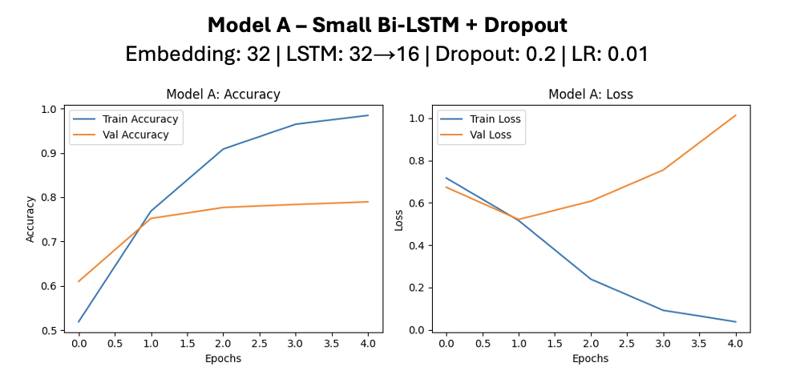

# StockSentimentAI: Financial News Sentiment Analysis for Stock Insights

**StockSentimentAI** is a financial news analytics project designed to predict the sentiment of stock headlines and assess how well different machine learning and deep learning models can classify market sentiment. By combining traditional methods like TF-IDF with SVMs and cutting-edge deep learning models like BiLSTM, BERT, and FinBERT, this project evaluates which approaches best uncover the emotional tone behind stock market news.

## Dataset Overview

The project leverages a comprehensive dataset with the following characteristics:
- **Source**: EODHD APIs (Stock Fundamental Data API)
- **Timeline**: 2021-2022 
- **Size**: 5,086 entries with 8 features
- **Companies**: ATVI, CVS, NDAQ, NFLX, NVDA, PLD, SBUX, SCHW, AAPL, TSLA
- **Task**: Sentiment classification (😊 Positive, 😐 Neutral, 😠 Negative) for cleaned single headlines

Through advanced feature engineering, hyperparameter tuning, and model experimentation, StockSentimentAI offers a thorough comparison of financial text mining methods for sentiment prediction.

## Motivation

Financial markets are heavily influenced by the tone and sentiment of news coverage. Positive headlines can drive stock prices upward, while negative ones can cause sharp declines.

This project addresses a critical question: **Can we reliably detect sentiment from stock headlines using AI models, and which models are best suited for this task?**

By exploring multiple techniques across classical and deep learning paradigms, StockSentimentAI seeks to contribute to more robust financial forecasting tools and enhance the understanding of news-based sentiment in markets.

## Project Architecture

## Tools and Technologies

## Evaluation Metrics

The project employs comprehensive evaluation metrics including:
- **Standard Classification Metrics**: Precision, Recall, Accuracy, F1-Score
- **BiLSTM-Specific Metrics**: Training/Validation Accuracy and Loss curves
- **Confusion Matrices**: For detailed classification performance analysis

## Machine Learning Methods and Results

### TF-IDF + Traditional Machine Learning

TF-IDF vectorization was used to convert news headlines into numerical representations. Several supervised models were applied:

**Performance Results:**
- **Support Vector Machine (SVM)**: **81.76%** test accuracy - highest overall performance
- **Random Forest**: 77.32% test accuracy with optimized parameters
- **Naive Bayes**: 78.40% test accuracy

These results demonstrate that, in financial text analysis, traditional feature engineering still holds significant predictive power when paired with strong algorithms.

### Deep Learning – BiLSTM Models

Five BiLSTM architectures were explored, varying in depth, width, and regularization (dropout):

#### Model A - Small BiLSTM + Dropout

**Architecture**: Embedding: 32 | LSTM: 32→16 | Dropout: 0.2 | LR: 0.01
- **Analysis**: Train accuracy reaches ~100%, validation plateaus at ~78%. Validation loss rises after 2 epochs → signs of overfitting.

#### Model B - Medium BiLSTM (No Dropout)

**Architecture**: Embedding: 64 | LSTM: 64→32 | Dropout: None | LR: 0.01
- **Analysis**: Severe overfitting with validation accuracy ~75%. Training loss decreases while validation loss increases heavily after 2 epochs.

#### Model C - Large BiLSTM + Dropout

**Architecture**: Embedding: 128 | LSTM: 64→32 | Dropout: 0.2 | LR: 0.01
- **Analysis**: Slight improvement to ~76-78% validation accuracy, but still shows overfitting patterns.

#### Model D - Balanced BiLSTM + Dropout

**Architecture**: Embedding: 64 | LSTM: 32→16 | Dropout: 0.2 | LR: 0.01
- **Analysis**: Better generalization with ~76% validation accuracy and reduced overfitting compared to earlier models.

#### Model E - Deep BiLSTM (No Dropout) ⭐ **Best Neural Model**

**Architecture**: Embedding: 64 | LSTM: 64→64 | Dropout: None | LR: 0.01
- **Analysis**: **Highest validation accuracy (~80%)** and most stable convergence. Demonstrates that deeper architectures can outperform regularization techniques.

These results highlight that deeper architectures, even without dropout, can outperform shallower ones if model capacity matches task complexity.

### Transformer Models – BERT and FinBERT

Transformer-based models were evaluated using pre-trained BERT and FinBERT embeddings combined with Random Forest and SVM classifiers.

#### BERT Performance

#### FinBERT Performance

- Both BERT and FinBERT **plateaued at ~63.81% test accuracy**, likely due to:
  - Lack of domain-specific fine-tuning.
  - Small dataset size compared to what Transformers require to generalize effectively.

Notably, FinBERT exhibited a heavy bias toward Neutral sentiment classifications, while BERT models leaned more heavily on Positive/Negative labels.

## Sentiment Analysis Visualization

### Tesla (TSLA) Word Clouds

The word cloud analysis reveals distinct patterns in positive vs. negative sentiment coverage for Tesla, with terms like "electric", "battery", "growth" dominating positive coverage, while "recall", "concerns", and "challenges" appear in negative sentiment headlines.

## Key Findings & Insights

**🏆 Performance Rankings:**
1. **TF-IDF + SVM**: 81.76% (Best Overall)
2. **Deep BiLSTM (Model E)**: ~80% validation accuracy (Best Neural Network)
3. **Word Embedding + SVM**: 79.78%
4. **TF-IDF + Naive Bayes**: 78.40%
5. **TF-IDF + Random Forest**: 77.32%
6. **BERT/FinBERT + Classifiers**: 63.81% (Needs fine-tuning)

**📊 Critical Observations:**
- **Traditional methods excel**: TF-IDF with SVM consistently outperformed complex deep models for this dataset size
- **Depth over dropout**: Deeper BiLSTM networks (Model E) provided superior stability without regularization
- **Transformer limitations**: BERT/FinBERT underperformed due to lack of domain-specific fine-tuning and small dataset size
- **Sentiment bias**: Heavy skew toward positive predictions across most models
- **Model-specific patterns**: FinBERT heavily favors Neutral classifications, while BERT models lean toward Positive/Negative with minimal Neutral predictions

## Challenges and Reflections

### Challenges
- Overfitting in shallow BiLSTM models despite using dropout, requiring careful tuning.
- Small sample size (5,000 headlines) constrained the effectiveness of large Transformer models without extensive fine-tuning.
- Sentiment imbalance: A skew toward Positive sentiments made model calibration challenging.

### Reflections
- Simple models still win: TF-IDF with SVM consistently outperformed even complex deep models in this context.
- Deep capacity matters: Deeper BiLSTM networks provided superior stability and generalization compared to shallow ones.
- Domain adaptation is crucial: Pre-trained Transformers like FinBERT underperformed without task-specific fine-tuning.

## Future Research Directions

### Immediate Improvements
- **Fresh Data Collection**: Scrape recent headlines (2023-2024) to enhance model generalization
- **Data Aggregation**: Instead of single daily headlines, merge all daily news into unified text blocks for richer context
- **Fine-tuning Experiments**: Implement proper BERT/FinBERT fine-tuning with optimized learning rates, loss functions, and 5-15 epoch training cycles

### Technical Enhancements
- **TensorFlow Data Pipeline**: Leverage `tf.data` for efficient batching and scalable BERT/FinBERT training
- **Multi-head Attention**: Explore advanced attention mechanisms for enhanced pattern recognition
- **Ensemble Methods**: Combine top-performing models (TF-IDF+SVM + Deep BiLSTM) for improved robustness

### Research Goals
Based on preliminary fine-tuning experiments achieving 58% accuracy with FinBERT over 10 epochs, future work will focus on optimizing hyperparameters and training stability to bridge the performance gap with traditional methods.

## Conclusion

StockSentimentAI demonstrates that **traditional machine learning models** like TF-IDF + SVM can still outperform deep and Transformer-based models for moderate-sized, domain-specific sentiment analysis tasks, while providing valuable insights into the effectiveness of different approaches for financial text mining.

By tailoring model choice to data size, task domain, and resource availability, businesses and researchers can build smarter, faster, and more reliable financial sentiment engines.

## References

- **Data Source**: [EODHD Stock Fundamental Data API](https://eodhistoricaldata.com/)
- **Bidirectional LSTM in NLP**: [GeeksforGeeks Guide](https://www.geeksforgeeks.org/bidirectional-lstm-in-nlp/)
- **Sentiment Classification Using BERT**: [GeeksforGeeks Tutorial](https://www.geeksforgeeks.org/sentiment-classification-using-bert/)
- **FinBERT Model**: [Hugging Face - FinBERT Tone](https://huggingface.co/yiyanghkust/finbert-tone)
- **Sentiment Analysis with LSTM**: [Analytics Vidhya](https://www.analyticsvidhya.com/blog/2022/01/sentiment-analysis-with-lstm/)
- **Project Repository**: [GitHub - StockSentimentAI](https://github.com/erica-prog/stock_news_headlines_sentiment_analysis)

**For more details, please refer to the [final code](new_headlines_with_the_single_headlines_datasets.py) and my [presentation](Sentiment_Analysis_Stock_Headlines.pdf).**
